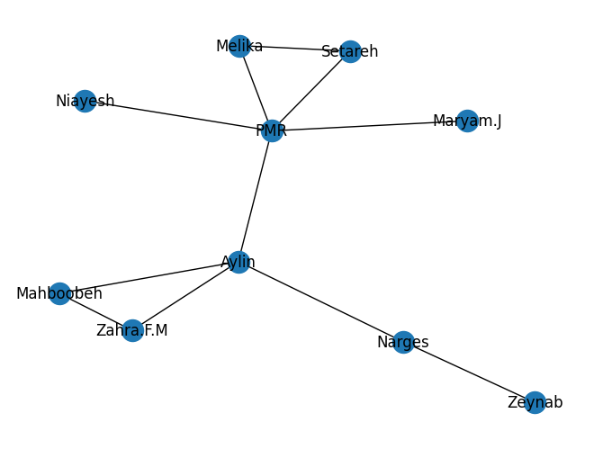

# Complex-Dynamic-Network
## Overview
You can find four projects that were finished during the **Complex Dynamic Networks** course. The datasets were downloaded from [Stanford Large Network Dataset Collection](https://snap.stanford.edu/data/index.html) section at **Stanford Network Analysis Project: SNAP**.

## Assignemt 2
### Datasets
- California Road Network
  ```txt
  # Directed graph (each unordered pair of nodes is saved once): roadNet-CA.txt 
  # California road network
  # Nodes: 1965206 Edges: 5533214
  # FromNodeId	ToNodeId
  0	1
  0	2
  0	469
  1	0
  1	6
  1	385
  2	0
  2	3
  469	0
  469	380
  ```
- Wiki Vote
  ```txt
  # Directed graph (each unordered pair of nodes is saved once): Wiki-Vote.txt 
  # Wikipedia voting on promotion to administratorship (till January 2008). Directed edge A->B means user A voted on B becoming Wikipedia administrator.
  # Nodes: 7115 Edges: 103689
  # FromNodeId	ToNodeId
  30	1412
  30	3352
  30	5254
  30	5543
  30	7478
  3	28
  3	30
  3	39
  3	54
  ```
- soc-Epinions1
  ```txt
  # Directed graph (each unordered pair of nodes is saved once): soc-Epinions1.txt 
  # Directed Epinions social network
  # Nodes: 75879 Edges: 508837
  # FromNodeId	ToNodeId
  0	4
  0	5
  0	7
  0	8
  0	9
  0	10
  0	11
  0	12
  0	13
  ```
- Also, a dataset of friendships in the dormitory was created by me, in which every edge indicates a friendship relation.
  
### Implementation
The following information and metrics have been calculated for all the datasets using the **NetworkX** library. 
1. No. Nodes
2. No. Edges
3. Average degree
4. Density
5. Clustering coefficient 1
6. Clustering coefficient 2
7. Diameter
8. Average shortest path length
9. Plot degree distribution
10. Assortativity (Degree Correlation)
11. Top 5 nodes based on 3 different centrality measures
12. Network Centralization

A common feature in all of those three networks was Assortativity (Degree Correlation), which was negative in all of them, and it means that nodes with high degrees tend to be connected to nodes with low degrees, which is referred to as disassortative mixing.

## Assignment 3
### Datasets
Same as [Assignment 2](https://github.com/AylinNaebzadeh/Complex-Dynamic-Network/edit/main/README.md#assignemt-2).
### Implementation
Three models for generating artificial networks, including Erdos Renyi, Watts Strogatz, and Barabasi Albert were used, and the datasets were fitted to these models. 
```python
n = len(G.nodes())
m = len(G.edges())
p = 2 * m / (n * (n - 1))

ER = nx.erdos_renyi_graph(n, p)
WS = nx.watts_strogatz_graph(n, 30, 0.5)
BA = nx.barabasi_albert_graph(n, int(m / 500))
```
The degree distribution, clustering coefficient, and transitivity for the generated network were calculated. The results showed that, in most cases, the metric values were lower than the real network results.

## Assignment 4
### Datasets
Same as [Assignment 2](https://github.com/AylinNaebzadeh/Complex-Dynamic-Network/edit/main/README.md#assignemt-2).
### Implementation
For this assignment, the communities were identified, and then the modularity value was calculated.
## Assignment 5
### Datasets
Same as [Assignment 2](https://github.com/AylinNaebzadeh/Complex-Dynamic-Network/edit/main/README.md#assignemt-2).
### Implementation
For this assignment, two epidemic models (SIR, SIS) and four scenarios with different generative models were tried.
